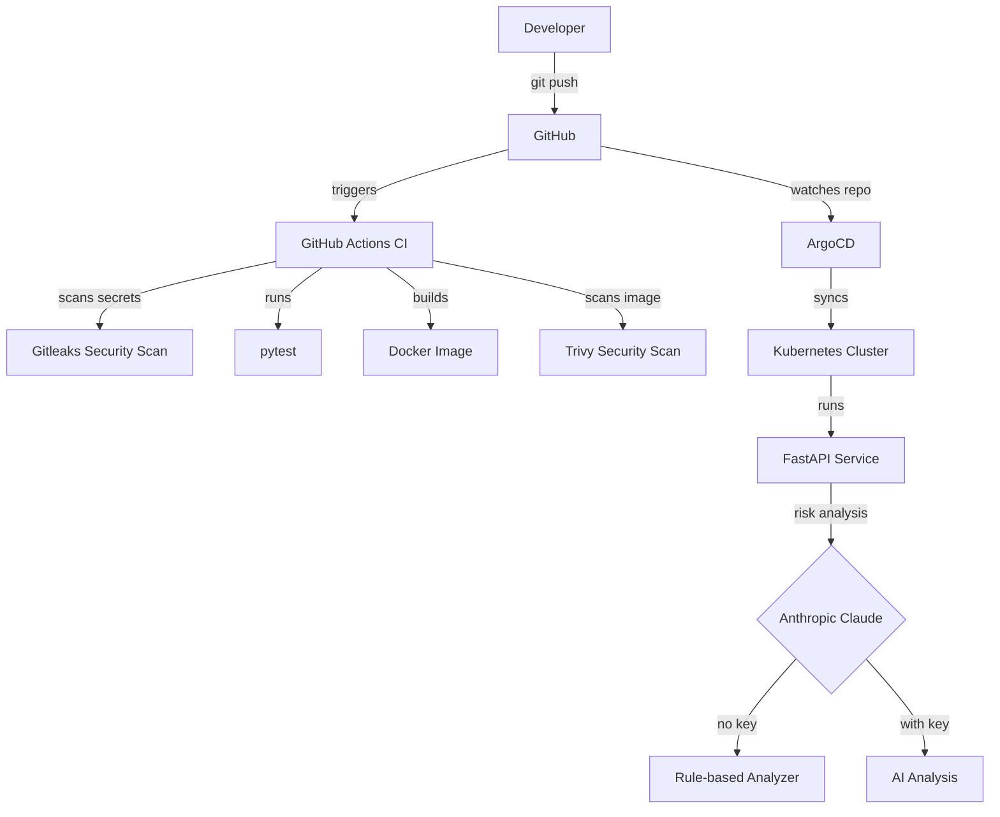

# AI Ops Platform

AI-powered deployment risk analyzer built with FastAPI, Docker, Kubernetes, GitOps, and GitHub Actions.

## Architecture



## Features

- `/health` — liveness check used by Kubernetes probes
- `/analyze-deployment` — returns risk score, level, and recommendations
- Graceful fallback to rule-based analysis when AI is unavailable
- Non-root Docker image for security
- Kubernetes-ready with resource limits and health probes
- GitOps with ArgoCD — cluster syncs automatically on every merge
- Helm chart with environment-specific values
- gitleaks scans every commit for secrets before tests run

## Tech Stack

| Layer | Technology |
|-------|-----------|
| API | FastAPI + Python 3.9 |
| Container | Docker |
| Orchestration | Kubernetes + Helm |
| GitOps | ArgoCD |
| CI/CD | GitHub Actions |
| Secret Scanning | Gitleaks |
| Image Scanning | Trivy |
| AI | Anthropic Claude (optional) |

## Quick Start

```bash
git clone git@github.com:gamzehelinaslan/ai-ops-platform.git
cd ai-ops-platform
python3 -m venv venv && source venv/bin/activate
pip install -r requirements.txt
uvicorn app.main:app --reload --port 8000
```

## API Usage

```bash
curl -X POST http://localhost:8000/analyze-deployment \
  -H "Content-Type: application/json" \
  -d '{
    "service_name": "payment-service",
    "image_tag": "latest",
    "environment": "production",
    "replicas": 1,
    "previous_incidents": 2
  }'
```

Response:
```json
{
  "risk_level": "HIGH",
  "risk_score": 100,
  "reasoning": "Production deployment | 2 previous incidents | Single replica | Using latest tag",
  "recommendations": [
    "Ensure rollback plan is ready",
    "Review incident history before deploying",
    "Increase replicas to at least 2 for resilience",
    "Pin to specific image digest instead of latest"
  ],
  "mock_mode": true
}
```

## Environment Variables

| Variable | Required | Description |
|----------|----------|-------------|
| `ANTHROPIC_API_KEY` | No | Enables AI analysis. Falls back to rule-based if not set. |
| `APP_ENV` | No | `development` or `production` |
| `APP_PORT` | No | Default: `8000` |

## Running Tests

```bash
pytest tests/ -v
```

## Helm Deployment

```bash
helm install ai-ops-platform ./helm/ai-ops-platform
```

## GitOps with ArgoCD

ArgoCD watches the `main` branch and syncs the cluster automatically on every merge. See `argocd/application.yaml` for configuration.